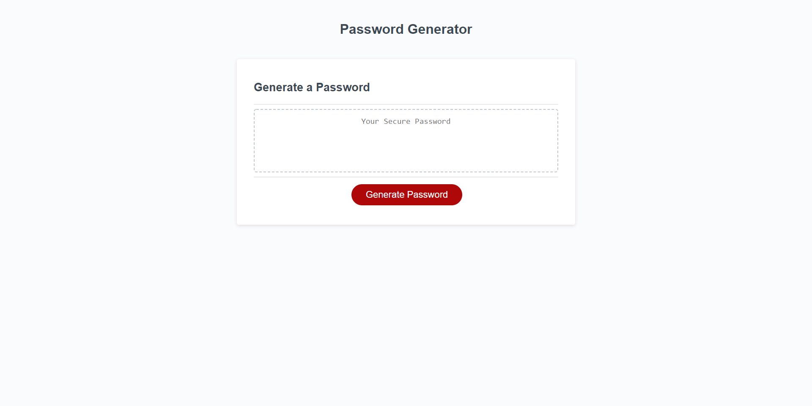
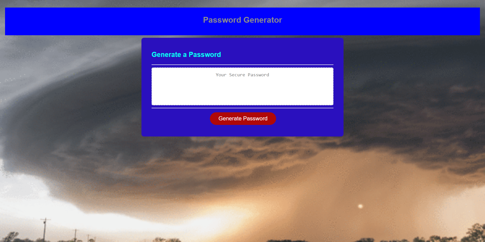

# Cloudy-with-a-chance-of-passwords

### Looks like its cloudy with a chance of passwords. 
[Click here to see website](https://lawrencesb24.github.io/Cloudy-with-a-chance-of-passwords/)

## Task at Hand

Good day reader. Hope you are doing well. Today, we are looking at modofying the functionality of a random password generator. Passwords are essntial for keeping information secure, from logging onto a food delivery app to working for an agency that requires all intel gathered to be kept safe. The more secure the password is, the more secure the information is. While having a password created from scratch by its user can perform on its own, the most secure passwords are a random generation of letter, numbers, and symbols.

## User Story

For our password generator, we are tasked with the following:

```
AS AN employee with access to sensitive data
I WANT to randomly generate a password that meets certain criteria
SO THAT I can generate a strong password that provides greater security
```

## Acceptance Criteria

```
GIVEN I need a new, secure password
WHEN I click the button to generate a password
THEN I am presented with a series of prompts for password criteria
WHEN prompted for password criteria
THEN I select which criteria to include in the password
WHEN prompted for the length of the password
THEN I choose a length of at least 8 characters and no more than 128 characters
WHEN asked for character types to include in the password
THEN I confirm whether or not to include lowercase, uppercase, numeric, and /or special characters
WHEN I answer each prompt
THEN my input should be validated an at least one character type should be selected
WHEN all prompts are answered
THEN a password is generated that matches the selected criteria
WHEN the password is generated
THEN the password is either displayed in an alert or written to the page
```

## Password Generator

So based on our acceptance criteria, our password will be generated is mostly random, only the user can specify HOW they want the generator to randomly produce their password. So here is a picture of the generator's appearance and functionality :



So the first picture displayed is the original design that the generator had before the code was modified. 

These are the new cosmetic changes added to the site:


These changes can be edited in the css file ![style.css] by commenting out lines in the body, header, and card sections

On the site, we are given a "Generate Password" button which when clicked will generate our criteria specifications. Once the button is pressed, we are given prompt windows that ask in the following order:
>1. How long would you like your password to be (Must be between 8 to 128 characters): 
>2. Would you like uppercase letters?
>3. Would you like numbers?
>4. Would you like symbols?

Though it appears that when we are prompted to answer these questions that we can type out anything and it will still read as valid. Fortunately, the generator has been coded to cancel out any values that do not qualify as valid responses (for instance, if you type "pizza" or nothing as an answer, the prompt will ask for you to enter a valid response, then brings the promt back up so that the response can be retyped). This will continue until the user answers the prompt correcly. After each answer is determined, then the generator will create the password using the JS file [script.js] based on the responses given. There is a demo video below to show the functionality.

### demo video:


#### PLEASE NOTE: While the appearance of the site differs from the original, that DOES NOT mean that they both have the same functionality. Both generators preform the same functionality and follow the same logic applied in the JS file. 